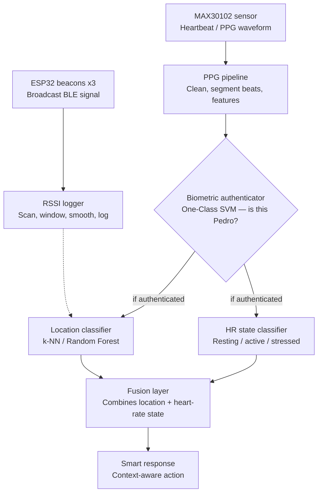

# context-aware-biometric-system
Edge ML system on a Raspberry Pi that fuses BLE indoor positioning with PPG heart-rate sensing, gated by biometric authentication.

```mermaid
flowchart TD
    ESP[ESP32 beacons x3<br/>Broadcast BLE signal] --> RSSI[RSSI logger<br/>Scan, window, smooth, log]
    PPG_S[MAX30102 sensor<br/>Heartbeat / PPG waveform] --> PPG_P[PPG pipeline<br/>Clean, segment beats, features]

    PPG_P --> AUTH{Biometric authenticator<br/>One-Class SVM — is this Pedro?}
    AUTH -->|if authenticated| LOC[Location classifier<br/>k-NN / Random Forest]
    AUTH -->|if authenticated| HR[HR state classifier<br/>Resting / active / stressed]
    RSSI -.-> LOC

    LOC --> FUSION[Fusion layer<br/>Combines location + heart-rate state]
    HR --> FUSION
    FUSION --> RESP[Smart response<br/>Context-aware action]
```
